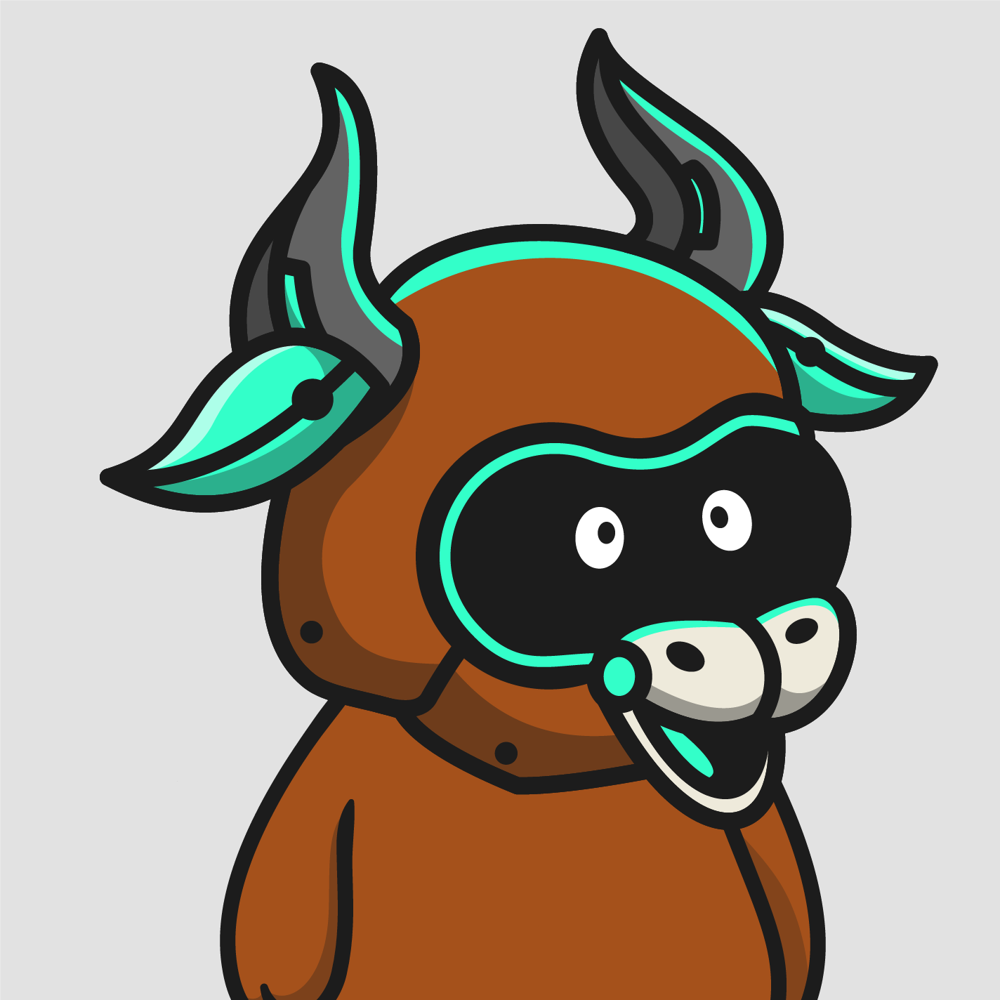

# REPOSITORY FOR THE ALCHEMY ROAD TO WEB3 DEVELOPER PROGRAM

### Project Description

This project mints Dynamic NFTs that change based on the market price of an asset pair (for example, the BTC/USD asset price). When prices go up, its a bull trend and when the go down its a bear trend. We run [Chainlink Keepers](https://docs.chain.link/docs/chainlink-keepers/introduction/) to have our smart contract automatically called at specified intervals so that on-chain logic checks the [Chainlink Price Feed](https://docs.chain.link/docs/using-chainlink-reference-contracts/) to see if there has been a change in price. Accordingly the minted NFTs dynamically alternate between the images below.

### Branches

- `main`: has the starting code and the IPFS picture and json files. Also has the Dynamic NFT (ERC721) smart contract code.
- `price-feeds` has the code that adds [Chainlink Data Feeds](https://docs.chain.link/docs/get-the-latest-price/) logic and functionality along with the implementation of the Keepers interface so that our NFT Contract is [Keepers compatible](https://docs.chain.link/docs/chainlink-keepers/compatible-contracts/). It also has the mock Price Feeds smart contract called `MockPriceFeed.sol` which can be used to mock what calls to the actual Chainlink price feed would do. An example of what the return value from a price feed looks like is: `int256 3034715771688` which denotes the price up to 8 decimals.
- `randomness` contains the code for the [assignment](#assignment)

### Assignment

Update the NFT contract code to make the following happen:

- track the current market trend (hint: use an enum like `enum MarketTrend{BULL, BEAR}`)
- update `performUpkeep` so that it tracks the latest market trend based on the `getLatestPrice()` and if there is a price change, it calls another function (eg `requestRandomnessForNFTUris()`) that initiates the process of calling a [Chainlink VRF V2 Coordinator](https://docs.chain.link/docs/get-a-random-number/) for a random number.
- implement `fulfillRandomWords()` as per the VRF documentation

A suggested implementation of the assignment is in the branch called `randomness`.

**Note:** if the dynamic NFT is taking time to show up on OpenSea that's not unusual. In that even just call your contracts `tokenUri()` method and check what IPFS URI is being pointed to. If it changes, then your code is working but OpenSea's cache may not show the new image for a while, even if you do a [force-update on Open Sea](https://docs.opensea.io/docs/3-viewing-your-items-on-opensea).
